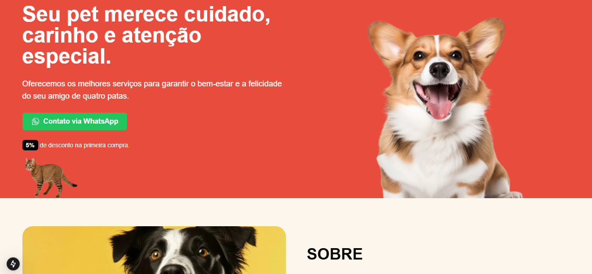
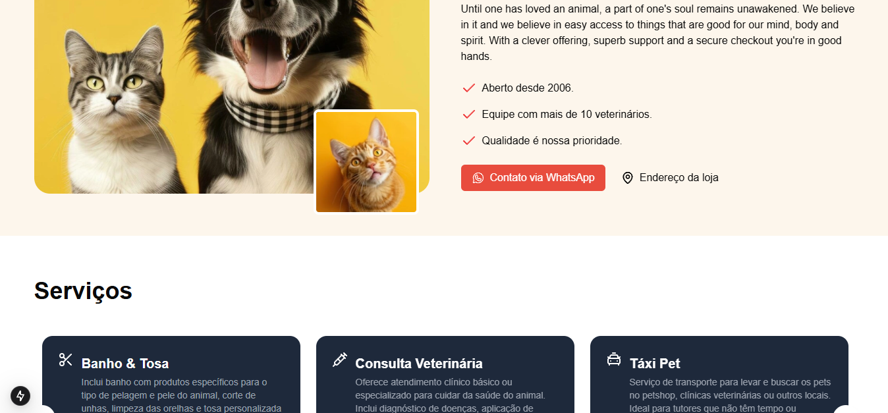
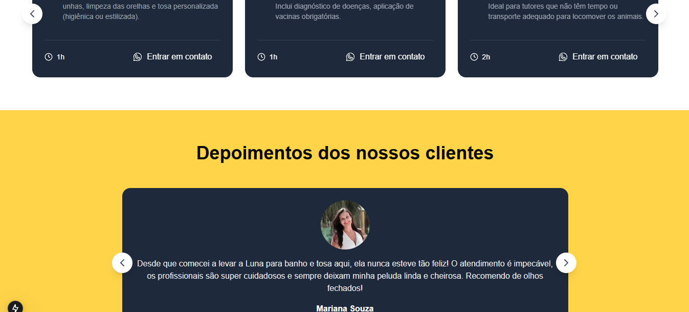
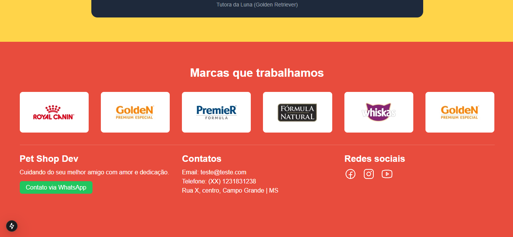

# 🐾 PetLove - Landing Page

Landing page, responsiva e otimizada para um Petshop fictício chamada **PetLove**, desenvolvida com **Next.js** e **TailwindCSS**. Ideal para divulgação de serviços, produtos, agendamentos e contato com clientes.

## 🔗 Deploy

Acesse a versão online: https://petlove-lp.netlify.app/

---

## 🚀 Tecnologias utilizadas

- [Next.js](https://nextjs.org/)
- [TailwindCSS](https://tailwindcss.com/)
- [TypeScript](https://www.typescriptlang.org/)

---

## 📸 Confira:

